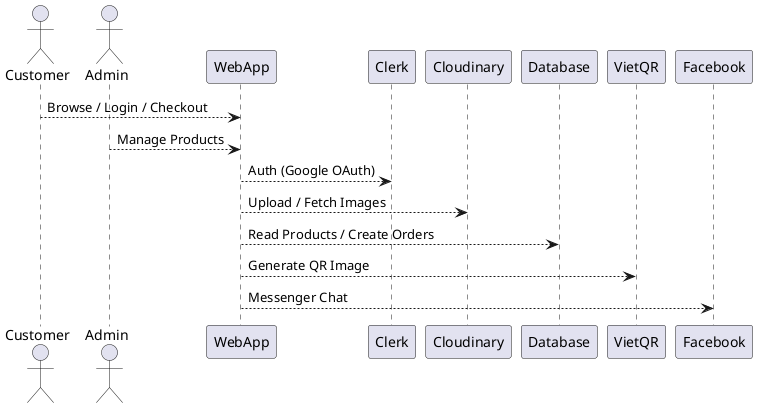

# SPEC-1-Modern E-commerce Website

## Background
The goal is to build a modern, youthful, and high-performance e-commerce website inspired by the attached PRD and research documents. The platform targets Gen Z shoppers in Vietnam and small-to-medium shop owners who want a branded online storefront without expensive SaaS fees. The system emphasizes fast loading, strong visual appeal, Google OAuth login, QR-based payments (VietQR/MoMo), and a simple admin dashboard for product management.

This design assumes the site will initially serve as a **digital showcase + lightweight ordering system**, not a full enterprise marketplace.

## Requirements
### Must-Have (P0)
- Modern, mobile-first storefront (Homepage, Product List, Product Detail)
- Google OAuth login for customers (Clerk)
- Shopping cart with persistent state
- Checkout via QR code (VietQR; MoMo optional later)
- Admin dashboard to add/edit/delete products
- Image upload and hosting (Cloudinary)
- Chat integration (Facebook Messenger)

### Should-Have (P1)
- Product search
- Order history for logged-in users
- Promotional banners / featured products

### Could-Have (P2)
- Online payment gateway (Stripe/VNPay/MoMo API)
- Inventory sync with external POS (e.g., KiotViet)
- Reviews and ratings

### Won’t-Have (for MVP)
- Automated payment reconciliation
- Complex shipping/logistics integrations

---

## Method

### 1. Architecture Overview
The system follows a **modern serverless e-commerce architecture** optimized for UI/UX performance, fast iteration, and low operational cost.

**High-level components:**
- **Frontend / Web App:** Next.js App Router (Server Components by default)
- **Auth:** Clerk (Google OAuth)
- **Database:** PostgreSQL (Supabase, self-hosted running on Docker)
- **ORM:** Prisma
- **Media:** Cloudinary (image CDN + optimization)
- **Payments:** VietQR (dynamic QR image generation)
- **Chat:** Facebook Messenger Customer Chat Plugin



---

### 2. UI/UX Design Principles (Critical)
UI/UX is treated as a **first-class requirement**, not decoration.

**Core principles:**
- Mobile-first (iPhone width as baseline)
- Visual hierarchy: image → price → CTA
- Zero friction: minimal forms, one-tap login
- Fast feedback: skeleton loaders, hover states

**Design system choices:**
- Tailwind CSS + shadcn/ui
- Rounded corners (`rounded-xl`)
- Soft shadows (`shadow-sm`, `shadow-md`)
- Generous whitespace (padding > margin)
- Primary color: Electric Blue (#007AFF)

---

### 3. Key Screens & UX Patterns

#### Homepage
- Hero banner (swipeable)
- "Trending / New Arrivals" product grid
- Category filter pills (horizontal scroll on mobile)

#### Product Card
- Large image (1:1)
- Price emphasized (bold, color)
- Clear CTA: "Add to Cart"

#### Product Detail
- Image gallery (Cloudinary optimized)
- Sticky "Add to Cart" button on mobile

#### Cart & Checkout
- Slide-over cart or dedicated page
- Price updates in real time
- Login gate only at checkout
- QR code centered and scannable

---

### 4. Data Model (MVP)

```prisma
model Product {
  id          String   @id @default(cuid())
  name        String
  description String?
  price       Int      // VND
  images      String[] // Cloudinary URLs
  category    String
  isActive    Boolean  @default(true)
  createdAt   DateTime @default(now())
  updatedAt   DateTime @updatedAt
}

model Order {
  id        String      @id @default(cuid())
  total     Int
  status    String      @default("PENDING")
  userId    String?
  items     OrderItem[]
  createdAt DateTime    @default(now())
}

model OrderItem {
  id        String  @id @default(cuid())
  orderId   String
  productId String
  quantity  Int
}
```

---

### 5. Similar Existing Applications (Reference)
- **Shopify Dawn Theme:** Clean hierarchy, strong imagery
- **TikTok Shop:** Mobile-first product discovery
- **Stripe Checkout:** Minimal steps, focused CTA

---

## Implementation

### 1. Deployment Model (Confirmed)
- **Environment:** VPS only
- **Orchestration:** Docker Compose (production)
- **Database:** Supabase (managed PostgreSQL, no local DB container)
- **Realtime:** Supabase Realtime (WebSocket) for live updates
- Set up Git, Vitest, and ESLint/TypeCheck
This ensures operational simplicity, strong UI responsiveness, and real-time admin/storefront sync.

---

### 2. Project Structure

```text
/
├── app/
│   ├── (store)/
│   │   ├── page.tsx
│   │   ├── product/[id]/page.tsx
│   │   └── checkout/page.tsx
│   ├── admin/
│   │   └── products/page.tsx
│   ├── api/
│   └── layout.tsx
├── components/
│   ├── ui/
│   ├── cart/
│   └── product/
├── lib/
│   ├── prisma.ts
│   ├── supabase.ts
│   ├── actions.ts
│   └── utils.ts
├── store/
│   └── cart.ts
├── prisma/
│   └── schema.prisma
├── docker/
│   └── Dockerfile
├── docker-compose.yml
└── .env
```

---

### 3. Supabase Realtime Integration (Key UX Feature)

**Use cases:**
- Products added/updated in Admin appear instantly on storefront
- Stock or price changes reflected without page refresh
- Order status updates (future P1)

**Channel strategy:**
- `products` table → broadcast changes
- Optional `orders` channel later

```ts
supabase
  .channel('products-realtime')
  .on('postgres_changes', { event: '*', schema: 'public', table: 'Product' }, payload => {
    // refresh product list UI
  })
  .subscribe();
```

UX impact: customers see **live updates**, admins feel instant control.

---

### 4. Cart Drawer (Global UX Pattern)
- shadcn/ui **Sheet** component
- Zustand store + localStorage
- Auto-open on first add
- Sticky checkout CTA on mobile

---

### 5. Admin Product Management
- Route: `/admin/products`
- Clerk middleware enforces Admin access
- CRUD via Server Actions
- Cloudinary widget for uploads
- Supabase Realtime triggers storefront refresh

---

### 6. Checkout & VietQR
- Order created in Supabase (status = PENDING)
- Dynamic VietQR image generated per order
- QR size optimized for mobile scanning

---

### 7. Dockerization (VPS Production)

#### Dockerfile
```dockerfile
FROM node:20-alpine
WORKDIR /app
COPY package*.json ./
RUN npm install
COPY . .
RUN npm run build
EXPOSE 3000
CMD ["npm", "start"]
```

#### docker-compose.yml
```yaml
version: "3.9"
services:
  web:
    build:
      context: .
      dockerfile: docker/Dockerfile
    ports:
      - "3000:3000"
    env_file:
      - .env
    restart: always
```

---

## UI Design Tokens & Component Checklist

> **Design Reference:** Apple Store Vietnam – clean, editorial, product-first, premium whitespace.

---

### 1. Apple-Inspired Homepage Layout (Critical)
Homepage adopts an **editorial layout**, not a marketplace grid.

**Structure (Top → Bottom):**

1. **Hero Product Section (Full-width)**
   - Single featured product / campaign
   - Very large typography
   - Minimal CTA (1 primary button)

2. **Secondary Highlights (2–3 sections)**
   - Alternating image/text alignment
   - One product or category per section

3. **Product Collections (Editorial Grid)**
   - Large cards, generous spacing
   - Not dense, not Shopee-style

4. **Accessory / Add-on Section**
   - Smaller cards, horizontal scroll on mobile

---

### 2. Typography System (Apple-like)

```text
Hero Headline: 40–48px / 700
Section Title: 28–32px / 600
Product Name: 17–18px / 500
Body Text: 15–16px / 400
Caption: 13–14px / 400
```

Rules:
- Headlines are **short, confident sentences**
- No ALL CAPS
- Line height is loose (1.3–1.5)

---

### 3. Color Usage Rules (Apple Style)

- Background: almost always **pure white**
- Primary color (Electric Blue) used **only for CTAs & links**
- Product sections rely on **imagery**, not color blocks

❌ Avoid:
- Bright gradients
- Multiple accent colors per screen

---

### 4. Spacing & Rhythm (Very Important)

```text
Vertical spacing between sections:
- Desktop: 96–120px
- Mobile: 56–72px

Max content width:
- 1200px (centered)
```

Rule:
> If a section feels "too close", add more whitespace.

---

### 5. Homepage Components (Apple-style)

#### Hero Section
- [ ] Full-width container
- [ ] Large headline
- [ ] One supporting sentence
- [ ] One primary CTA
- [ ] Large product image (centered)

#### Editorial Section
- [ ] Split layout (Text | Image)
- [ ] Text max-width ~420px
- [ ] CTA as text-link or subtle button

#### Product Card (Homepage only)
- [ ] Large image
- [ ] Minimal text
- [ ] No borders
- [ ] Hover = slight elevation

---

### 6. Interaction Rules (Apple Feel)
- Hover effects are **subtle** (opacity, translateY 2–4px)
- No bouncing, no flashy animations
- Scroll experience must feel "calm"

---

### 7. What We Explicitly Do NOT Copy
- Sticky sales popups
- Countdown timers
- Aggressive discounts

---

### 8. Mapping Apple Style → Your Store

| Apple Store | Your Homepage |
|------------|---------------|
| Hero iPhone | Featured Product / Promotion |
| Product Stories | Category Highlights |
| Accessories row | Add-on / Best sellers |

---

## Milestones

### Day 1 – Foundation
- Next.js + Tailwind + shadcn setup
- Layout, Header, Cart Drawer shell

### Day 2 – Storefront UI
- Homepage (Hero, Product Grid)
- Product Detail page

### Day 3 – Admin Dashboard
- Admin auth protection
- Product CRUD + Cloudinary

### Day 4 – Cart & Checkout
- Zustand cart
- VietQR checkout flow

### Day 5 – Realtime & Polish
- Supabase Realtime integration
- Skeleton loaders, mobile polish

### Day 6 – Docker & VPS Deploy
- Docker build
- Docker Compose prod deploy

### Day 7 – QA & Launch
- Mobile testing
- Performance audit
- Go-live

---

## Gathering Results

### Functional Validation
- Admin updates reflect instantly (Realtime)
- Cart persists across reloads
- QR payment displays correct amount

### UX Metrics
- Lighthouse Performance > 90
- Homepage LCP < 1.5s (mobile)
- Checkout completion < 3 minutes

### Post-Launch Monitoring
- Supabase logs (DB + Realtime)
- VPS container health
- User feedback on UX friction

---

## Need Professional Help in Developing Your Architecture?

Please contact me at [sammuti.com](https://sammuti.com) :)

